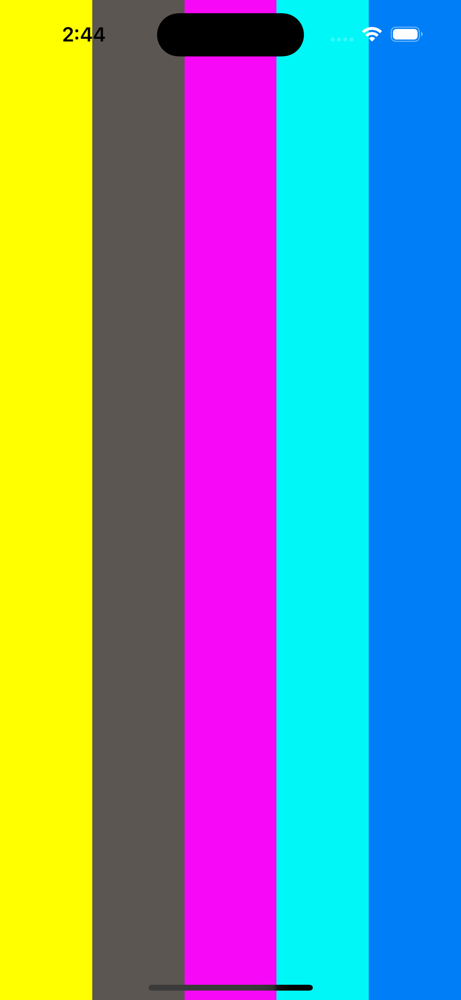
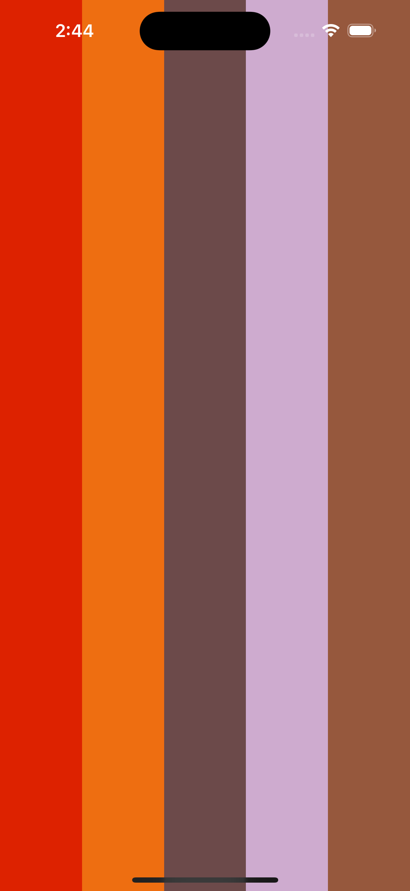
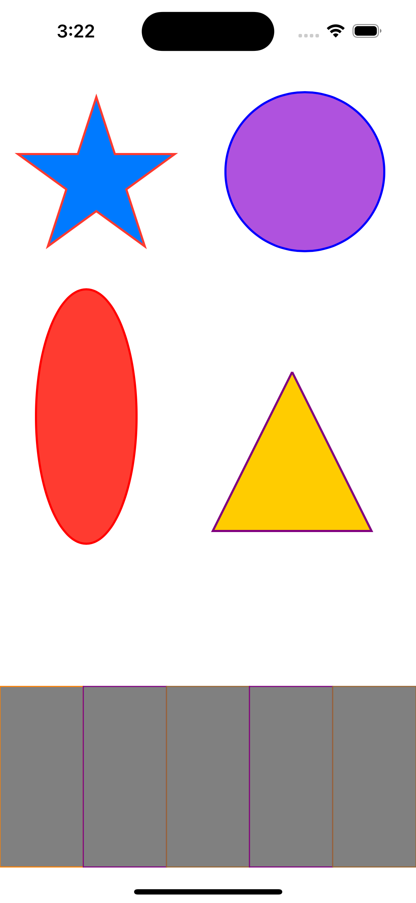

# FantasticView

# Project preview

<p float="left">
  
   
  

</p>


# How to Use

## First case
Step 1: Take a view in your storyboard

Step 2: Set Custom class of view to HBStickerView

Step 3: Build and Run.

## Second case

```swift
        let fantasticView = FantasticView(frame: self.view.bounds)
        
        self.view.addSubview(fantasticView)
```  
